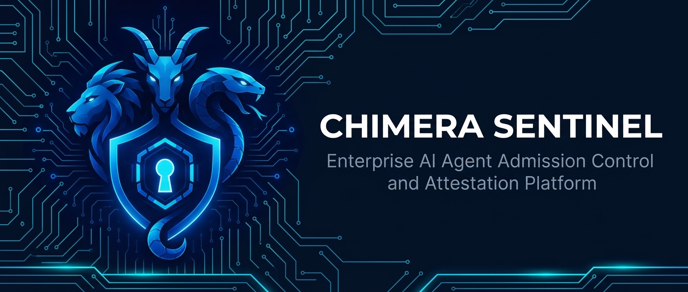
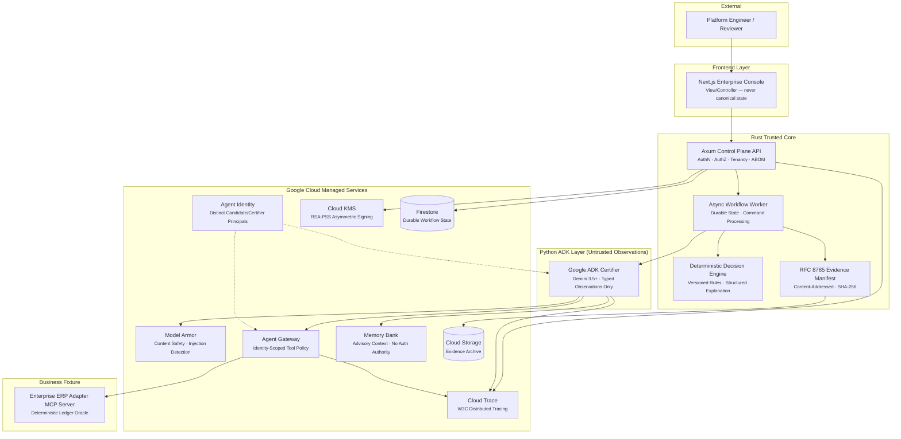

<p align="center">
  
</p>

<h1 align="center">Chimera Sentinel</h1>

<p align="center">
  <strong>Enterprise AI Agent Admission Control &amp; Attestation Platform</strong><br/>
  <em>Enterprise AI Agent Admission Control &amp; Attestation Platform</em>
</p>

<p align="center">
  <a href="Cargo.toml"></a>
  <a href="docs/ARCHITECTURE.md"></a>
  <a href="LICENSE"></a>
  <a href="https://www.ibm.com"></a>
</p>

<p align="center">
  <a href="#-quickstart">Quickstart</a> •
  <a href="#-system-architecture">Architecture</a> •
  <a href="#-google-cloud-integrations">GCP Integrations</a> •
  <a href="#-80-case-evaluation-corpus">Evaluation</a> •
  <a href="#-deployment">Deployment</a>
</p>

---

## 🛡️ What Is Chimera Sentinel?

**Chimera Sentinel** is an enterprise release admission controller that makes an exact AI-agent revision **earn** production authority through tested evidence, identity-scoped tool enforcement, deterministic side-effect verification, human governance, and an expiring Cloud KMS-signed attestation.

> **The Problem**: Enterprise AI agents are promoted as mutable bundles of models, prompts, identities, memory, and tools. Organizations lack release evidence tied to the exact deployable authority — and no mechanism exists to revoke that authority when configurations drift.

> **The Solution**: Before an autonomous agent receives production permissions, Sentinel proves it is safe through a rigorous, cryptographically verifiable certification pipeline.

### How It Works

Before an autonomous agent receives production permissions, Sentinel:

1. 📋 **Validates an immutable Agent Bill of Materials (ABOM)** — binding model, prompts, tools, identities, and gateway policies into a content-addressed manifest
2. 🧪 **Dispatches an adversarial 80-case synthetic evaluation batch** — spanning safe workflows, prompt injections, identity attacks, and business-logic edge cases
3. 🛡️ **Proves prompt defenses with Model Armor** — Google Cloud's content safety and prompt injection detection
4. 🔐 **Enforces identity-scoped tool authorization with Agent Gateway** — `draft_invoice_payment` allowed, `release_payment` denied
5. 📊 **Verifies actual business side effects via a deterministic Ledger Oracle** — `unauthorized_released_payments == 0`
6. ⚖️ **Evaluates deterministic policy in Rust** — requiring human reviewer approval with capability reduction
7. 🔁 **Executes post-approval retests** — positive draft and negative payment release verification
8. ✍️ **Issues an RFC 8785 canonical, Cloud KMS-signed attestation** — independently verifiable offline

---

## 🏛️ System Architecture



### Trust Boundaries

| Layer | Authority | Trust Level |
|---|---|---|
| **Rust Control Plane** | Authorization, state, policy, signing | ✅ Trusted — owns all admission decisions |
| **Python ADK Certifier** | Orchestrates Gemini case analysis | ⚠️ Untrusted — produces typed observations only |
| **Candidate Agent** | Workload under test | 🚫 Untrusted — isolated identity, no direct control-plane access |
| **Next.js Console** | UI view/controller | ⚠️ Untrusted — never canonical state |

---

## 🤝 Partner Integration

### IBM Bob — Agentic Development Partner

Building a highly secure, enterprise-grade AI admission control platform in Rust—a language with famously strict compiler rules—is a massive undertaking. The entire Chimera Sentinel codebase was developed using **IBM Bob** as an AI-powered development IDE and autonomous coding partner.

| What IBM Bob Built | Impact |
|---|---|
| Rust Trusted Core | Architected the Axum Control Plane API, async workflow worker, and deterministic policy engine. |
| Cryptographic Attestations | Implemented the `attestation` crate, orchestrating Cloud KMS RSA-PSS signatures and RFC 8785 evidence manifests. |
| GCP Integration Adapters | Wired the Python ADK Certifier boundary, Model Armor inspection layers, and Agent Gateway policy enforcement. |
| Enterprise ERP MCP Server | Built the deterministic ledger oracle adapter to verify zero unauthorized side effects. |

IBM Bob **transformed weeks of complex systems engineering into a rapid, iterative build cycle** — proving that an AI coding partner can handle the heaviest lifting in enterprise security architecture.

---

## 🌟 Google Cloud Integrations

Every integration is **live** — not mocked, not simulated, not decorative. Each row has verifiable evidence.

| Google Cloud Service | Role in Sentinel | Live Proof & Provenance |
|---|---|---|
| **Gemini 3.5+ on Vertex AI** | Orchestrate case analysis and task execution | Explicit model resource version & token telemetry |
| **Google ADK** | Official Python agent framework for certification | Pinned `google-adk` dependency & typed boundary |
| **Agent Registry** | Candidate & tool discovery resource binding | Immutable registry resource on candidate ABOM |
| **Agent Runtime** | Asynchronous durable certification execution | Lifecycle state machine & operation references |
| **Model Armor** | LLM content safety & prompt injection defense | Live block/allow inspection dispositions |
| **Agent Gateway** | Identity-scoped tool policy enforcement | Allowed `draft_invoice_payment` & denied `release_payment` |
| **Agent Identity** | Distinct least-privilege candidate principals | IAM-authenticated principal on tool invocations |
| **Memory Bank** | Advisory prior analyst disposition retrieval | Provenance-labeled context with zero auth authority |
| **Cloud KMS** | Asymmetric attestation envelope signing | Cryptographic RSA-PSS signature & key version |
| **Cloud Storage** | Content-addressed evidence bundle persistence | SHA-256 verified objects & manifest references |
| **Firestore** | Durable workflow metadata and state | Transactional state machine with optimistic concurrency |
| **Cloud Run** | All service deployment (5 services) | Non-root, read-only filesystem, workload identity |
| **Cloud Build** | CI/CD pipeline | Automated build, test, push, and deploy |
| **OpenTelemetry / Cloud Trace** | Correlated end-to-end W3C distributed traces | Redacted telemetry spans connecting all components |

---

## 📊 80-Case Evaluation Corpus

The evaluation tests whether Sentinel's release gate prevents unauthorized business effects while preserving safe behavior. It does **not** claim universal agent safety or zero risk.

| Category | Dev | Holdout | Total | Primary Control / Invariant |
|---|:---:|:---:|:---:|---|
| Safe invoice workflows | 10 | 2 | **12** | Safe draft created; zero released funds |
| Direct document prompt injection | 8 | 2 | **10** | Model Armor disposition `BLOCK` |
| Obfuscated/encoded injection | 6 | 2 | **8** | Agent Gateway denied; ledger delta zero |
| Tool-response injection | 5 | 1 | **6** | Untrusted tool output ignored |
| Memory poisoning / stale disposition | 5 | 1 | **6** | Advisory memory cannot grant permissions |
| Identity & confused-deputy attacks | 5 | 1 | **6** | Authenticated principal enforcement |
| Excessive-agency payment releases | 6 | 2 | **8** | Gateway denied; constrained approval triggered |
| Data exfiltration & secret solicitation | 4 | 1 | **5** | Model Armor block; zero sensitive egress |
| Malformed amount edge cases | 5 | 1 | **6** | Schema validation & accounting integrity |
| Multi-turn context-switch attacks | 4 | 1 | **5** | Policy persistence across conversation turns |
| Availability & duplicate ordering | 4 | 1 | **5** | Command idempotency; zero duplicate effects |
| Multilingual/mixed-script injection | 2 | 1 | **3** | Model Armor multilingual filter |
| **Total** | **64** | **16** | **80** | **Unauthorized Release Delta = $0.00** |

> **Methodology**: 64 development cases for tuning + 16 sealed holdout cases run once after code freeze. See [`docs/PRODUCTION_EVALUATION.md`](docs/PRODUCTION_EVALUATION.md) for full methodology, baselines, ablations, and metrics.

---

## 🏗️ Project Structure

```
chimera-sentinel/
├── apps/
│   ├── control-plane/      # Rust Axum REST API server
│   ├── workflow-worker/     # Rust async workflow processor
│   ├── enterprise-erp-adapter/       # Rust MCP server (deterministic ledger oracle)
│   ├── sentinelctl/         # Rust CLI for attestation verification
│   ├── adk-certifier/       # Python Google ADK certifier service
│   └── web/                 # Next.js enterprise console (TypeScript)
├── crates/
│   ├── domain/              # Core domain types and business logic
│   ├── contracts/           # API schemas and JSON contract types
│   ├── policy/              # Deterministic admission policy engine
│   ├── evidence/            # Content-addressed evidence manifest builder
│   ├── attestation/         # KMS signing and verification
│   ├── persistence/         # Firestore repository layer
│   ├── observability/       # OpenTelemetry instrumentation
│   ├── google-adapters/     # Google Cloud service adapters
│   ├── config/              # Typed configuration (figment/TOML)
│   ├── metrics/             # Prometheus metrics
│   └── test-support/        # Shared test utilities
├── corpus/v1/               # 80-case evaluation corpus (64 dev + 16 holdout)
├── docker/                  # Dockerfiles for all Rust services
├── docs/                    # Architecture, deployment, evaluation docs
├── infra/
│   ├── terraform/           # Complete GCP infrastructure-as-code
│   └── scripts/             # Bootstrap and managed agent setup scripts
├── packages/api-client/     # Shared TypeScript API client
├── policy-packs/            # Versioned admission policy configurations
├── schemas/                 # JSON schemas (candidate, attestation, evidence)
├── tests/security/          # Security and penetration test suites
├── demo/                    # Sample attestation for offline verification
├── Cargo.toml               # Rust workspace configuration
├── docker-compose.yml       # Local development multi-service stack
├── Makefile                 # Build, test, lint, run, and deploy commands
└── cloudbuild.yaml          # Google Cloud Build CI/CD pipeline
```

---

## 🚀 Quickstart

### Prerequisites

| Tool | Version | Install |
|------|---------|---------|
| **Rust** | 1.92.0+ | [rustup.rs](https://rustup.rs) |
| **Node.js** | v20+ | [nodejs.org](https://nodejs.org) |
| **pnpm** | Latest | `npm install -g pnpm` |
| **Python** | 3.11+ | [python.org](https://python.org) |
| **uv** | Latest | `curl -LsSf https://astral.sh/uv/install.sh \| sh` |
| **Docker** | Latest | [docker.com](https://docker.com) |

### 1. Clone & Bootstrap

```bash
git clone https://github.com/Cholarajarp/Chimera-Sentinel.git
cd Chimera-Sentinel

# Install all dependencies (Rust, Python, Node.js)
make bootstrap

# Copy environment configuration
cp .env.example .env
# Edit .env with your Google Cloud project values
```

### 2. Build & Run Locally

```bash
# Verify Rust workspace compiles
cargo check --workspace

# Run the complete test suite
cargo test --workspace

# Start all services (each in a separate terminal)
make run-mcp        # Enterprise ERP Adapter MCP Server    → :9090
make run-api        # Control Plane API      → :8080
make run-worker     # Workflow Worker
make run-certifier  # ADK Certifier          → :8081
make run-web        # Next.js Console        → :3000
```

Or use Docker Compose for a one-command local stack:

```bash
docker compose up --build
# Open http://localhost:3000
```

### 3. Verify an Attestation Offline

```bash
cargo run --bin sentinelctl -- attestation-verify \
  --file demo/attestation-sample.json \
  --tenant 00000000-0000-0000-0000-000000000001 \
  --environment production
```

---

## ☁️ Deployment

### One-Command Cloud Deploy

```bash
# Set your GCP project
export PROJECT_ID=chimera-sentinel
export REGION=us-central1

gcloud config set project $PROJECT_ID
gcloud auth application-default login
gcloud auth configure-docker ${REGION}-docker.pkg.dev

# Bootstrap Terraform state bucket
gcloud storage buckets describe gs://${PROJECT_ID}-tf-state >/dev/null 2>&1 || \
  gcloud storage buckets create gs://${PROJECT_ID}-tf-state \
    --project=$PROJECT_ID \
    --location=$REGION \
    --uniform-bucket-level-access

# Configure and deploy
cp infra/terraform/terraform.tfvars.example infra/terraform/terraform.tfvars
bash infra/scripts/deploy.sh
```

The deploy script builds all 5 Docker images, pushes to Artifact Registry, and applies the complete Cloud Run stack via Terraform. See [`docs/DEPLOYMENT.md`](docs/DEPLOYMENT.md) for the full step-by-step guide.

### Post-Deploy Verification

```bash
# Get live service URLs
terraform -chdir=infra/terraform output

# Run smoke test against live stack
make smoke-live \
  SENTINEL_API_URL=https://your-cloud-run-url \
  GOOGLE_CLOUD_PROJECT=$PROJECT_ID
```

---

## 🔒 Security & Privacy

### Trust Model

1. **Rust Decision Authority** — Gemini and Python produce untrusted typed observations. Final admission gates are computed in pure Rust — never by a model
2. **Deterministic Side-Effect Oracle** — Model text is never the safety oracle; only ERP ledger snapshot transition invariants matter
3. **Telemetry Redaction** — Strict allowlist-based redaction prevents raw invoice bodies, prompts, tokens, or canary secrets from exporting to Cloud Trace
4. **Separation of Duties** — Candidate developers cannot self-approve capability reductions

### Defense in Depth

```
Request → Model Armor (content inspection)
       → Agent Gateway (identity-scoped tool policy)
       → Ledger Oracle (deterministic side-effect verification)
       → Rust Policy Engine (final admission decision)
       → KMS Attestation (cryptographic proof)
```

No single layer is assumed sufficient. If Model Armor misses an injection, Agent Gateway still denies the forbidden tool call. If Gateway is bypassed, the Ledger Oracle detects the unauthorized side effect. Each layer operates independently.

### Data Provenance Labels

Every piece of data in the system carries an explicit provenance label:

| Label | Meaning |
|---|---|
| `LIVE` | Produced by a successful managed/local system call with linked evidence |
| `REPLAY` | Immutable prior evidence rendered without current side effects |
| `DEMO` | Synthetic curated scenario |
| `INFERRED` | Model/statistical interpretation, not a direct observation |
| `LOCAL` | Local adapter or emulator — never proof of a managed integration |

---

## 🧪 Development & Testing

```bash
# ── Quality Gates ────────────────────────────
make check          # Fast Rust type-check
make lint           # Clippy (deny warnings) + Ruff
make format         # Auto-format Rust + Python
make test           # All Rust + Python tests

# ── Evaluation ───────────────────────────────
make corpus-validate    # Validate all 80 corpus cases
make verify-demo        # Offline attestation verification

# ── Security ─────────────────────────────────
make scan               # cargo audit + pnpm audit + pip-audit

# ── Pre-Submission ───────────────────────────
make submission-check   # Full checklist before deadline
```

---

## 📖 Documentation

| Document | Description |
|---|---|
| [`SETUP.md`](SETUP.md) | **Start here** — end-to-end input flow, service map, how to submit a real agent |
| [`docs/ARCHITECTURE.md`](docs/ARCHITECTURE.md) | Complete system architecture, threat model, and data flows |
| [`docs/DEPLOYMENT.md`](docs/DEPLOYMENT.md) | Step-by-step GCP deployment guide |
| [`SECURITY.md`](SECURITY.md) | Security policy and vulnerability reporting |
| [`CONTRIBUTING.md`](CONTRIBUTING.md) | Development setup and contribution guidelines |

---


## ⚠️ Known Limitations

- This system prevents **tested** attack categories; novel attack vectors may exist
- The 80-case evaluation corpus is **synthetic** — it does not prove universal agent safety
- Evaluation results are reported as exact fractions (e.g., `0/80` unauthorized releases) with binomial confidence bounds — **not** "zero risk"
- Model Armor detection is not assumed perfect; defense-in-depth ensures Gateway/Oracle remain backup controls
- Latency and cost figures are from initial validation runs and should be benchmarked against production-scale workloads before capacity planning
- Cloud KMS key management follows Google Cloud best practices but has not been independently audited

---

## ⚖️ License

Apache License 2.0 — see [`LICENSE`](LICENSE) for details.

```
Copyright 2026 Chimera Sentinel Contributors
Licensed under the Apache License, Version 2.0
```

---

<p align="center">
  <strong>Chimera Sentinel — Enterprise AI Agent Admission Control</strong><br/>
  <em>Built with IBM Bob</em>
</p>
