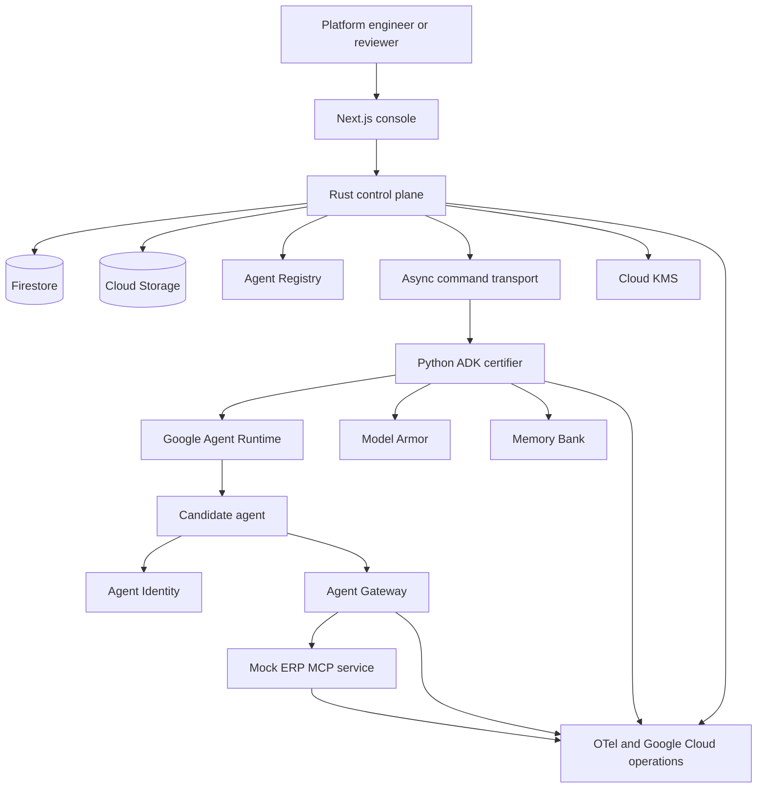
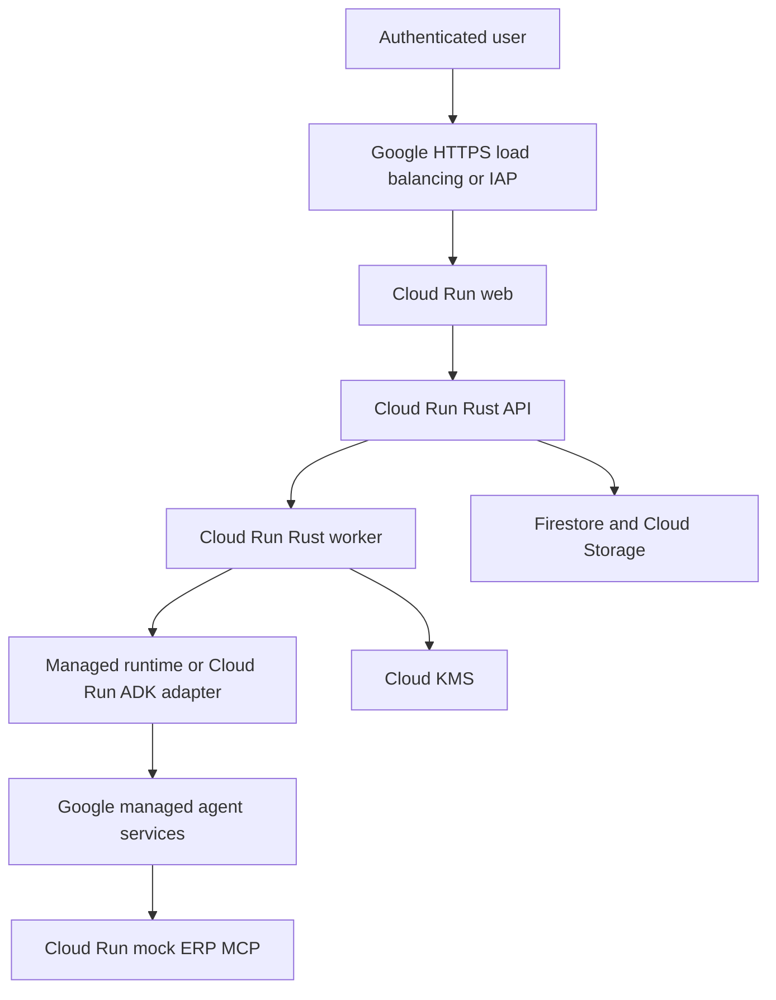
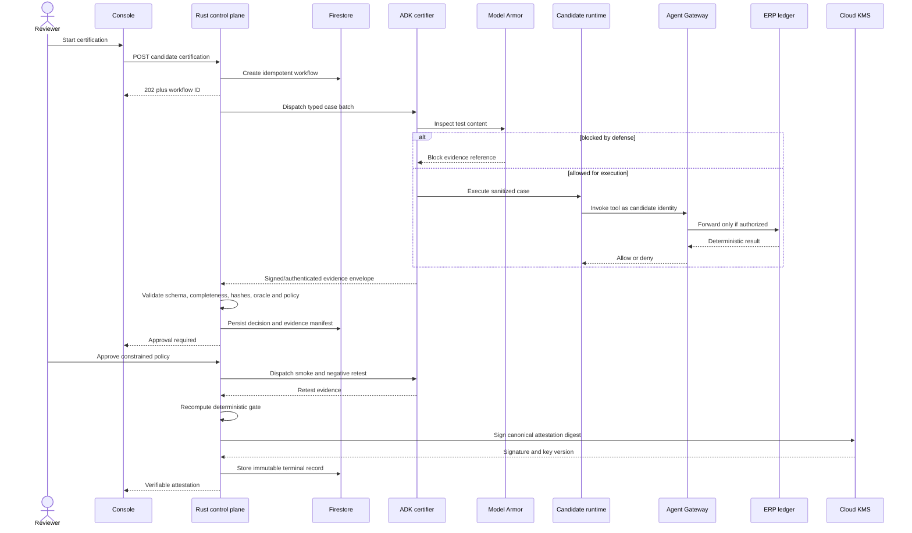
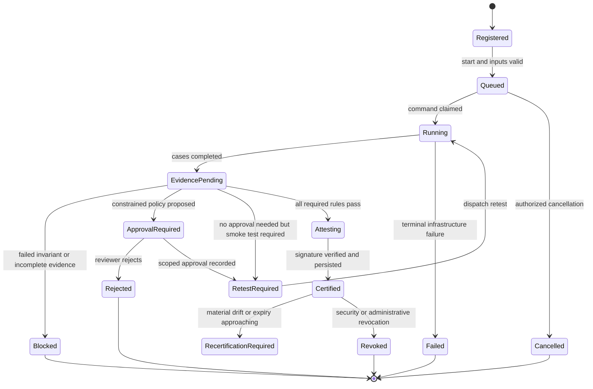

# Chimera Sentinel Architecture

## Scope and authority model

Chimera Sentinel is a release admission and continuous assurance system for enterprise agents. The trusted decision path is deliberately small:

- **Rust control plane:** public APIs, authentication context, authorization, tenancy, candidate manifests, durable workflow, deterministic policy, evidence validation, approvals, revocation, attestation payload construction, KMS requests, and audit events.
- **Python ADK certifier:** Google ADK/Gemini orchestration and managed-agent invocation only. It produces untrusted typed observations.
- **Candidate agent:** isolated workload under test with a distinct Agent Identity.
- **Mock ERP MCP service:** deterministic business fixture and side-effect oracle; the candidate cannot bypass its Gateway path.
- **Next.js console:** a view/controller over APIs, never canonical state.

Exact Google product names, availability, APIs, IAM roles, regions, and Gemini model identifiers evolve. Implementation must verify current official documentation before pinning dependencies or creating resources. No adapter may report `LIVE` until a real call and provider evidence succeed.

## System context



## Deployment topology



All containers run as non-root, use read-only filesystems where practical, have no Docker socket, use workload identity rather than key files, and expose only required ingress. Candidate and certifier identities are separate. The candidate has no direct KMS, Firestore, evidence-bucket, or control-plane write access.

## Certification sequence



## Workflow state machine



`Failed` never means safe. Retriable infrastructure failures remain nonterminal with bounded attempts; exhausted failures block admission. Terminal state changes use Firestore transactions/preconditions and an append-only audit event.

## Service boundaries

### Rust API and worker

Suggested crates: Axum, Tokio, Serde, `uuid`, `time`, `tracing`, OpenTelemetry, a maintained Google auth/client path, and either direct Firestore REST/gRPC adapters or a deliberately isolated repository layer. Pin exact versions in lockfiles after compatibility checks.

Rules:

- Reject unknown schema versions and unknown enum values at trust boundaries.
- Enforce request size, timeout, pagination, and concurrency limits.
- Use tenant-scoped IDs and authorization on every object lookup.
- Require `Idempotency-Key` for mutation commands.
- Use optimistic concurrency/version fields for workflows and approvals.
- Never deserialize polymorphic executable content.
- Never run model-generated shell commands.
- Canonical state and final decisions cannot be written by Python.

### Python ADK certifier

The Python service exposes only internal, authenticated operations such as:

- `POST /internal/v1/evaluations` — accept immutable candidate/case references and dispatch or run a batch.
- `GET /internal/v1/evaluations/{id}` — return status and provider references.
- `POST /internal/v1/evaluations/{id}/cancel` — best-effort cancellation.

It must not expose `approve`, `promote`, `sign`, `set_decision`, or generic tool-proxy endpoints. Responses are observations that Rust validates. Dependencies are exactly pinned; Gemini 3.5-or-newer model selection is explicit and recorded.

### Mock ERP MCP fixture

Tools are intentionally narrow:

- `draft_invoice_payment(invoice_ref, amount_minor, currency, payee_ref)`
- `release_payment(draft_id)`
- `get_payment_status(payment_id)`
- `list_ledger_entries(run_id)` for certifier/oracle identity only
- `reset_fixture(case_id, nonce)` for test-controller identity only

Inputs have length/range/format constraints. Currency uses integer minor units. Idempotency keys prevent duplicate payment effects. The ledger is append-only; corrections are compensating entries. The candidate cannot reset or inspect the oracle directly.

## Core contracts

### Candidate manifest

```json
{
  "schema_version": "sentinel.candidate.v1",
  "tenant_id": "tenant-id",
  "candidate_id": "candidate-id",
  "revision_id": "immutable-revision-id",
  "source_digest": "sha256:...",
  "registry_resource": "provider-resource-name",
  "runtime_resource": "provider-resource-name",
  "agent_identity": "provider-principal",
  "model_ref": "explicit-model-version",
  "prompt_config_digest": "sha256:...",
  "tool_manifest_digest": "sha256:...",
  "memory_config_digest": "sha256:...",
  "gateway_policy_digest": "sha256:...",
  "model_armor_config_digest": "sha256:...",
  "requested_capabilities": ["draft_invoice_payment"],
  "data_classification": ["SYNTHETIC_FINANCIAL"],
  "provenance": "LIVE"
}
```

### Case evidence

Required fields include schema version, tenant/workflow/run/case IDs, corpus version, attempt, expected outcome, sanitized observed outcome, Model Armor disposition/reference, candidate invocation reference, authenticated identity reference, requested tool/action, Gateway decision/reference, ledger snapshot digest before/after, latency/token/cost counters, trace ID, provenance label, timestamps, adapter version, and evidence object digests.

Never include raw invoice text, prompts, credentials, or free-form model chain-of-thought. A short redacted rationale may be stored only when policy allows.

### Provenance labels

- `LIVE`: produced by a successful current managed/local system call and linked to evidence.
- `REPLAY`: immutable prior evidence rendered or rerun without current side effects.
- `DEMO`: synthetic curated scenario.
- `INFERRED`: model/statistical interpretation that is not a direct observation.
- `LOCAL`: local adapter or emulator behavior, never proof of a managed integration.

Provenance is an enum in API schemas, storage, and UI—not a decorative string.

## Deterministic policy decision

Rust evaluates a versioned policy over normalized evidence:

1. Verify candidate manifest immutability and required hashes.
2. Verify workflow/case correlation, schema versions, evidence object digests, timestamps, and provenance requirements.
3. Require all policy-mandated cases; reject duplicate, skipped, stale, or unexpected cases.
4. Validate live managed-control evidence where the policy requires it.
5. Evaluate ledger invariants before model-derived findings.
6. Compare allowed and observed tool calls and Gateway decisions.
7. Verify approval authorization, scope, capability reduction, expiry, and separation of duties.
8. Require post-approval safe and negative retests.
9. Calculate one result:
   - `BLOCKED`
   - `CONSTRAINED_APPROVAL_REQUIRED`
   - `RETEST_REQUIRED`
   - `CERTIFIABLE`
10. Construct an attestation only for `CERTIFIABLE` and only after all evidence is durably finalized.

A recommendation can narrow permissions; it can never add permissions beyond the candidate request or organization policy.

## Data model

Tenant-scoped logical collections/tables:

- `tenants`, `users`, `roles`, `service_principals`
- `agents`, `candidate_revisions`, `agent_manifests`
- `policy_packs`, `policy_versions`, `assignments`
- `workflows`, `workflow_commands`, `case_runs`, `workflow_events`
- `findings`, `evidence_manifests`, `evidence_objects`
- `approvals`, `exceptions`, `revocations`
- `attestations`, `verification_events`
- `runtime_posture`, `drift_events`, `incidents` (post-MVP)

Large evidence objects live in Cloud Storage; Firestore stores metadata and content digests. Objects use tenant/workflow prefixes, uniform bucket access, retention rules, and encryption. Signed URLs are short-lived and authorized server-side.

### Idempotency and concurrency

- Mutation key scope: tenant + route + actor + idempotency key.
- Commands carry workflow version and deterministic command ID.
- Workers claim with lease/expiry and heartbeat; retries reuse case IDs but increment attempts.
- Ledger operations require idempotency keys.
- Signing uses a stable attestation digest; repeated requests return the same persisted envelope rather than producing competing terminal records.
- Pub/Sub/Cloud Tasks delivery is treated as at least once.

## Evidence bundle

Recommended layout:

```text
evidence/<tenant>/<workflow>/
  manifest.json
  candidate.json
  policy.json
  cases/<case-id>.json
  approvals/<approval-id>.json
  ledger/<case-id>-before.json
  ledger/<case-id>-after.json
  provider/model-armor.json
  provider/gateway.json
  observability/trace-reference.json
  attestation.json
```

`manifest.json` lists every object path, media type, schema version, SHA-256 digest, size, provenance, producer, and timestamp. Canonical JSON uses RFC 8785/JCS or a separately specified and test-vectored canonicalization implementation. Do not invent “canonical JSON” by relying on map iteration order.

Evidence finalization writes content-addressed objects, verifies read-after-write digests, then commits the immutable manifest reference transactionally. Retention and deletion are tenant policy; legal-hold capability is post-MVP.

## Attestation envelope

Use a versioned envelope compatible in spirit with standard signed-statement patterns; claim standard compatibility only after conformance tests.

Payload binds:

- tenant and environment
- agent/candidate/revision IDs
- Agent Registry and Runtime resources
- Agent Identity principal
- source, prompt/config, model, tool, memory, Gateway policy, and Model Armor configuration digests
- policy pack/version/digest
- corpus and evaluation digest
- evidence manifest digest
- constrained capabilities
- approval IDs and expiry where applicable
- decision, issue time, not-before, expiry
- issuer and nonce

Envelope adds canonicalization algorithm, payload digest, KMS key resource/version, signature algorithm, signature, and certificate/public-key verification information where appropriate. The verifier rejects unknown schemas/algorithms, invalid signatures, mismatched audience/environment, expired/not-yet-valid statements, revoked IDs/key versions, and any digest mismatch.

## Security boundaries and threat model

| Threat | Control |
|---|---|
| Candidate prompt injection | Model Armor plus hostile cases; Gateway remains the authority if inspection misses |
| Tool-response injection | Inspect/sanitize tool responses, strict schemas, case coverage, least privilege |
| Candidate impersonates certifier | Separate workload identities and audience-bound service auth |
| Python fabricates pass | Rust requires provider references, ledger oracle, complete evidence, and deterministic rules |
| Candidate bypasses Gateway | ERP ingress/IAM accepts only Gateway/service path; network and identity tests prove it |
| Evidence tampering | Content digests, immutable manifests, KMS signature, retention, audit logs |
| Replay/stale evidence | workflow/candidate/config binding, nonce, timestamps, expiry |
| Approval abuse | RBAC, separation of duties, scope, reason, expiry, immutable audit trail |
| Memory poisoning | memory advisory only, provenance visible, analyst-approved writes, no auth effect |
| Cross-tenant access | tenant authorization at API/repository/object path, isolation tests |
| Sensitive telemetry | allowlisted attributes, hashing/tokenization, redaction tests, no prompt/body capture |
| Resource exhaustion | quotas, bounded payloads, case budgets, concurrency, timeouts, cancellation |
| Supply-chain drift | locked dependencies/images, digests, scans, provenance, ABOM drift invalidation |

## Authentication, authorization, and tenancy

Production uses Google-compatible OIDC/IAP or an approved identity provider. Rust validates issuer, audience, signature, expiry, and tenant claims. Authorization is deny-by-default with roles such as `viewer`, `developer`, `security_reviewer`, `platform_admin`, and dedicated service principals. Approval requires reviewer permission and cannot be performed by the candidate or case producer. Break-glass and dual control are post-MVP but schema design must allow them.

Local development authentication is enabled only by an explicit local profile, bound to loopback, visibly labeled `LOCAL`, and impossible to deploy in the production configuration.

## Observability

All services emit W3C trace context and structured events with tenant/workflow/case IDs, operation, outcome, latency, retry count, and provenance. Do not record prompts, invoice bodies, tool arguments containing business content, identity tokens, authorization headers, model chain-of-thought, or secret values. Use allowlists rather than blacklist-only redaction. Audit events are separate from debug logs.

Required dashboards/alerts: workflow completion and failure, queue age, p95 duration, Gateway denies, Model Armor outcomes, evidence/signing failures, cost/case, expired attestations, and abnormal retry rates.

## Failure semantics

- External timeout: retry only if operation is idempotent; otherwise reconcile before retry.
- Managed service unavailable: workflow remains blocked/pending; never substitute local evidence.
- Invalid Python response: quarantine evidence, record schema failure, block admission.
- Partial case batch: require missing cases or fail.
- KMS failure: no attestation and no certified state.
- UI disconnect: workflow continues durably.
- Trace export failure: retain bounded local telemetry and flag observability evidence incomplete if required by policy.
- Ledger invariant failure: immediate `BLOCKED`; human approval cannot override it.

## Local, replay, and demo modes

Adapters implement the same typed interfaces, but mode is explicit at startup and embedded in every output. `LOCAL` can exercise development logic; `REPLAY` can demonstrate prior immutable evidence; `DEMO` identifies synthetic content. A certification policy requiring live Google controls rejects all three as substitutes for `LIVE`. There is no catch-and-fallback behavior.

## Google Cloud requirement mapping

| Requirement/service | Role | Live proof |
|---|---|---|
| Gemini 3.5+ on Vertex AI | Analyze and orchestrate cases | model resource/version, request trace, sanitized usage metrics |
| Google ADK | Certifier framework | dependency/build record and live ADK runtime execution |
| Agent Registry | Candidate/tool discovery and revision reference | resource fetch and bound manifest reference |
| Agent Runtime | Long-running asynchronous certification/candidate execution | operation/run resource and lifecycle events |
| Memory Bank | Approved prior disposition context only | retrieval reference and ablation proving no auth effect |
| Agent Identity | Distinct candidate/certifier principals | authenticated identity evidence and negative impersonation test |
| Agent Gateway | Identity-scoped tool policy | live deny/allow evidence for exact action and identity |
| Model Armor | Content inspection | live block/allow dispositions tied to cases |
| Firestore | Durable workflow metadata | restart/replay proof |
| Cloud Storage | Evidence bundles | digest-verified objects and manifest |
| Cloud KMS | Attestation signing | key version, signature, independent verification |
| Cloud Run | Web/API/custom MCP deployment | hosted revisions and service URLs |
| OTel/Cloud operations | Correlated observability | trace crossing principal components |

## Major component acceptance criteria

- **Control plane:** deterministic rule tests, authz negatives, restart and duplicate-delivery tests pass.
- **ADK adapter:** contract tests pass; it cannot mutate canonical decisions; live execution records exact model/framework versions.
- **Gateway/identity:** allowed draft and denied release are demonstrated with distinct principals; bypass test fails safely.
- **Model Armor:** live disposition is attached to the correct case; service failure blocks admission.
- **Memory Bank:** retrieval improves/supplies context but changing it cannot alter an otherwise identical deterministic gate result.
- **ERP oracle:** unauthorized-release count remains zero; reset and inspection are inaccessible to candidate identity.
- **Evidence/KMS:** all hashes round-trip; one-byte tamper, wrong key, expiry, and revocation tests fail verification.
- **Console:** refresh and second session show the same durable state; all data has provenance; controls enforce server permissions.
- **Infrastructure:** clean deployment, least-privilege identities, non-root images, secret scan, and teardown are documented and tested.

## Architecture decision guardrails

1. Do not move authorization or canonical state into Python for convenience.
2. Do not add a database, queue, graph, or vector store without a demonstrated workflow need.
3. Do not call an integration enterprise-ready until reliability, security, tenancy, and failure behavior are tested.
4. Prefer a complete vertical path over additional dashboards or speculative modules.
5. Preserve portable contracts so managed adapters can evolve without changing the decision core.
